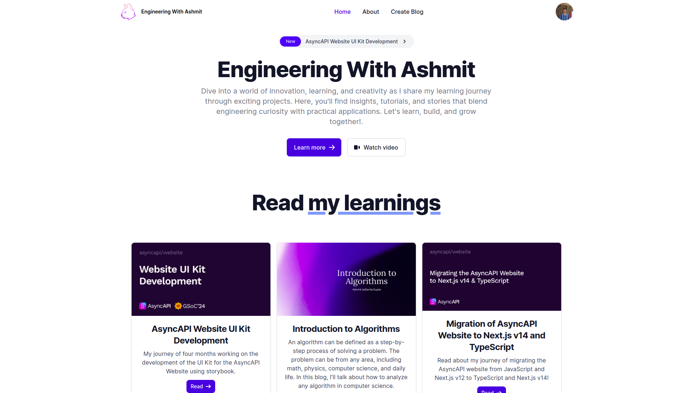

<div style="text-align: center;">
    
    <h1>Engineering With Ashmit</h1>
    <p>A blogging application for Ashmit JaiSarita Gupta where he can share engineering stuffs he learns and does.</p>
</div>

## Visit the site
The site is live [here](https://engineeringwithashmit.ashmit.dev/).

## Features
- An Express.js application for sharing my blogs with complete server-side rendering and dynamic content delivery.
- RESTful APIs for managing blogs, user authentication, and dynamic content delivery following MVC pattern.
- Utilizes EJS templating engines and Flowbite to create server-side rendered UI and MongoDB to store application Data.
- Utilizes Marked.js to convert markdown to HTML for blog content.
- User can create an account and log into the application.
- User can create, edit, and delete blogs.
- Users can add or remove comments in any blog.
- User dashboard to manage and showcase blogs.
- Profile page to manage user information.


## Techstack
### Backend
- Node.js
- Express.js
- JWT
- Dotenv
- EJS
- Marked
- Tailwind CSS
- Flowbite

### Deployment and Storage
- Database: [MongoDB Atlas](https://www.mongodb.com/atlas/database)
- Backend: [Render](https://render.com/)

## Contributor
- Developed by [Ashmit JaiSarita Gupta](https://github.com/devilkiller-ag).

# Development Guide
## Available Scripts for Server

In the server directory, you can run:

### `npm run dev`

Runs the app in the development mode.\
Open [http://localhost:8001](http://localhost:8001) to view it in your browser.

The page will reload when you make changes.\
You may also see any lint errors in the console.


## Available Scripts for Docker
#### Prerequisites:
- [install Docker](https://docs.docker.com/get-docker/)
- [install Docker Compose](https://docs.docker.com/compose/install/)

After cloning the repository to your local, perform the following steps from the root of the repository.

#### Steps to build and run local docker image:
1. Build the Docker image and run the container:
    ```bash 
    docker compose up
    ```
2. Open [http://localhost:8001](http://localhost:8001) to view it in your browser.

#### Steps to build and run docker image from dockerhub:
1. Pull the image from dockerhub:
    ```bash
    docker pull devilkillerag/engineeringwithashmit:latest
    ```
2. Run the container:
    ```bash
    docker run -p 8001:8001 devilkillerag/engineeringwithashmit:latest
    ```
3. Open [http://localhost:8001](http://localhost:8001) to view it in your browser.


#### Steps to build a new version and upload to docker hub:
1. Build the Docker image:
    ```bash
    docker build -t devilkillerag/engineeringwithashmit:<version_name> .
    ```
2. Push the image to docker hub:
    ```bash
    ddocker push devilkillerag/engineeringwithashmit:<version_name>
    ```
